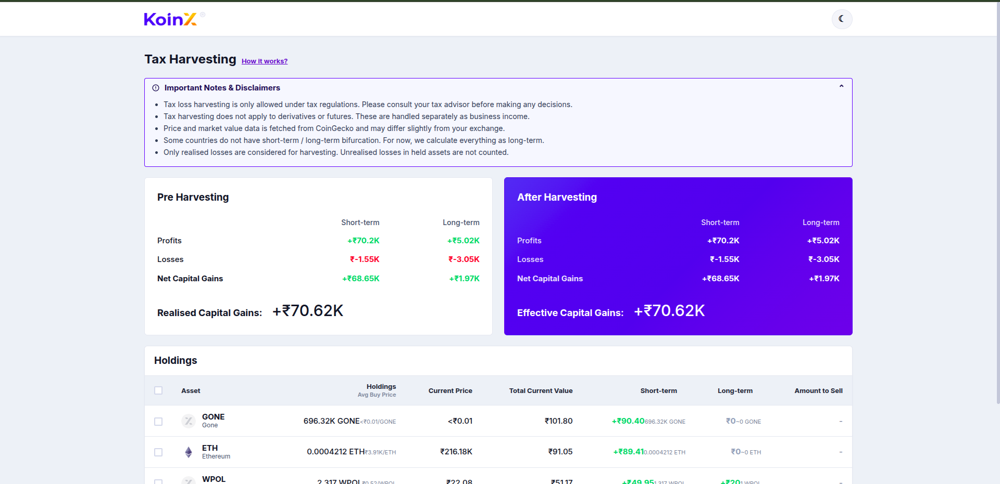
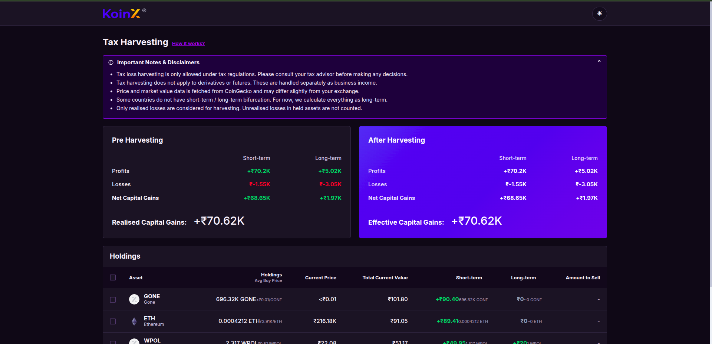
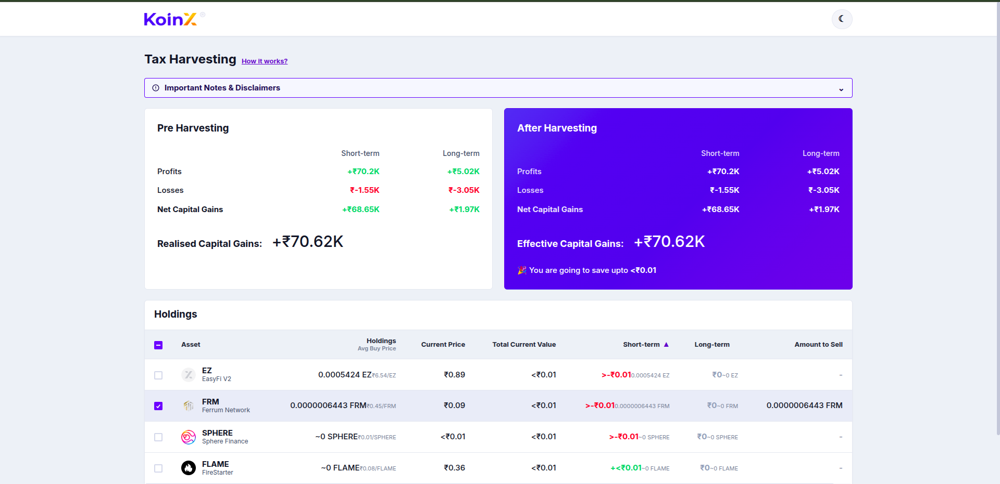
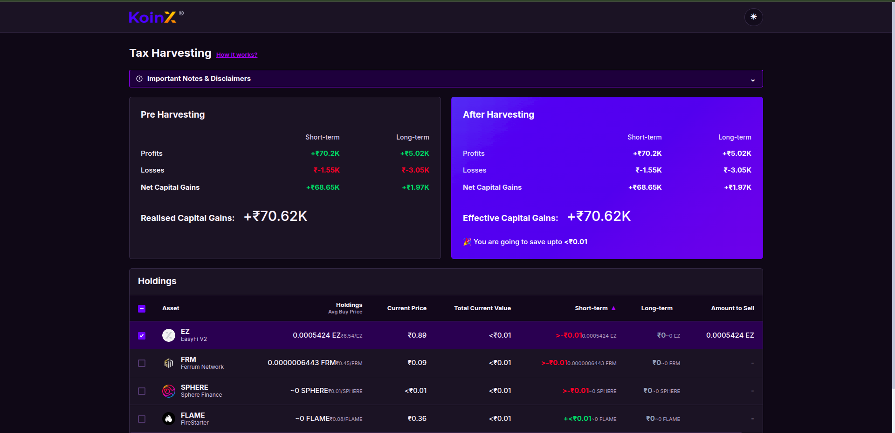
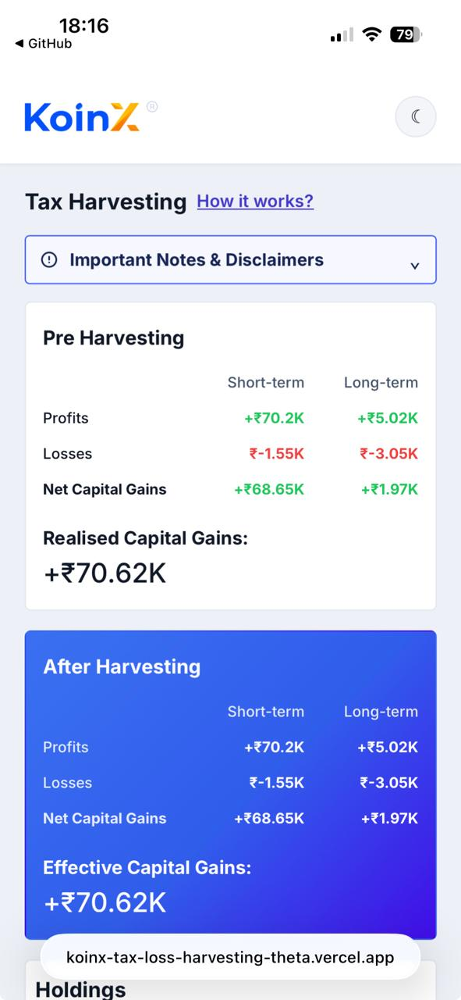
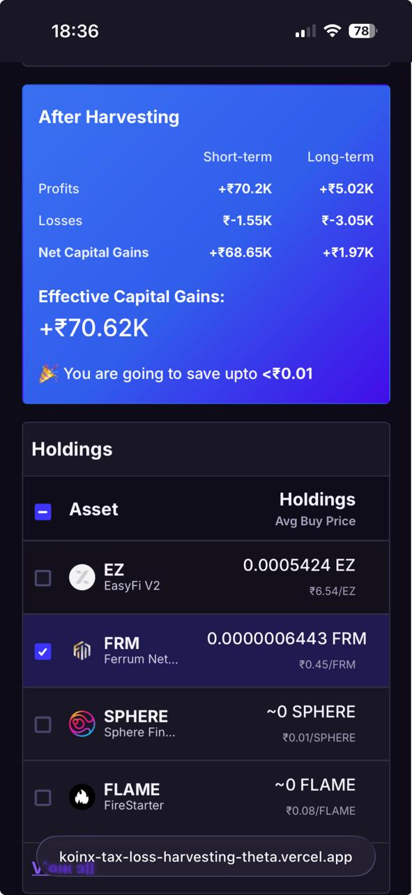
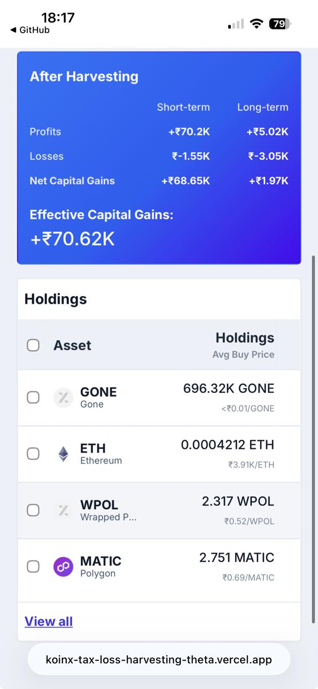

# KoinX – Tax Loss Harvesting Tool

A responsive React application for simulating tax loss harvesting on crypto holdings.

## Live Demo

https://koinx-tax-loss-harvesting-theta.vercel.app/

## Screenshots

### Desktop





### Selection State





### Mobile








## Setup & Run

```bash
npm install
npm start
```

The app opens at `http://localhost:3000`.

You can also run the development server with:

```bash
npm run dev
```

## Build

```bash
npm run build
```

## Folder Structure

```
src/
  api/
    mockApi.js          # Mock API (Promise-based, no server needed)
  components/
    GainsCard.jsx       # Capital gains display card
    GainsCard.css
    HoldingsTable.jsx   # Selectable holdings table with skeleton loader
    HoldingsTable.css
  hooks/
    useHarvesting.js    # Core state management hook
  utils/
    format.js           # Number/currency formatting helpers
  App.jsx
  App.css
  index.js
```

## Features

- **Pre-Harvesting card** — shows STCG/LTCG profits, losses, net, and realised gains from the Capital Gains API.
- **After Harvesting card** — mirrors pre-harvesting; updates in real-time as holdings are selected/deselected.
- **Savings banner** — shown only when post-harvest realised gains < pre-harvest realised gains.
- **Holdings table** — sortable by short-term and long-term gains, select all/individual rows, skeleton loader, "View all" toggle.
- **Qty to sell** — auto-populated with `totalHolding` when a row is selected.
- **Mobile responsive** — fluid grid, horizontal scroll on table.
- **Theme toggle** — light and dark modes with persisted preference.
- **Compact values** — large values are displayed with K/M suffixes and full values appear on hover.
- **Error & loading states** — shimmer skeletons while APIs resolve; error banner on failure.

## API Mocking

Both APIs are mocked as Promises in `src/api/mockApi.js` with realistic delays (600ms and 900ms). No external server required.

## Assumptions

- `gains` from the Holdings API represent unrealised gains/losses on the current balance.
- Selecting a holding adds its STCG/LTCG gains to post-harvest figures (positive → profits, negative → losses).
- Holdings are sorted by absolute total gain (largest impact first) for UX clarity.
- INR (₹) is used throughout as the currency.
